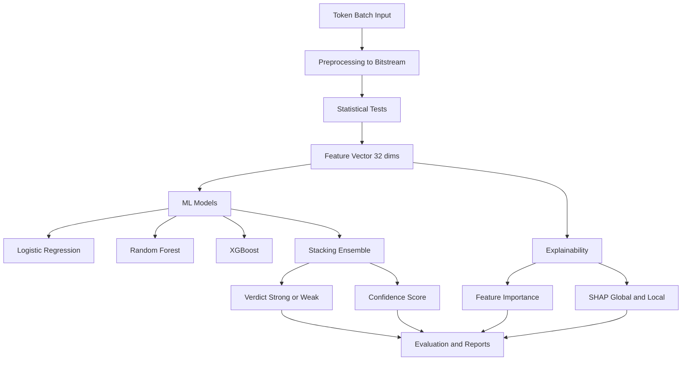

# RandFusion Research Master Context

This document is a complete project dossier for RandFusion, designed to be pasted into an LLM as context for paper writing, analysis, and technical Q&A.

Use this as the single source for:
- Project goals and motivation
- End-to-end architecture and pipeline
- Full codebase map and implementation details
- Dataset design and feature engineering
- Model design, baselines, explainability, and evaluation
- Result interpretation and limitations
- Reproducibility and artifact inventory

---

## 1. Project Identity

- Project name: RandFusion
- Definition: ML-based aggregation framework for cryptographic randomness evaluation
- Primary objective: Fuse multiple statistical randomness signals into a single strong/weak decision with confidence and explanation
- Intended domain: Randomness auditing and research, not cryptographic certification

Core product statement from PRD:
- Existing approaches run independent tests with hard thresholds and fragmented outputs
- RandFusion treats randomness evaluation as supervised classification over statistical features
- Output is a unified verdict plus explainability

---

## 2. Problem Statement

Cryptographic token generation depends on high-quality randomness. Weaknesses can include bias, predictability, short periods, or hidden structure. Traditional pass/fail test-by-test workflows have limitations:

- Tests are independent and do not model interactions
- Binary thresholds lose gradient information
- Borderline samples are hard to interpret consistently
- Token batches are short and structured compared to long stream assumptions

RandFusion addresses this by training models on feature vectors derived from classical statistical tests.

---

## 3. Scope and Non-Goals

In-scope:
- Token randomness evaluation
- NIST-style statistical testing and complementary metrics
- Feature extraction and supervised ML classification
- Baseline comparisons
- Explainability (feature importance and SHAP)
- Reporting and stress testing

Out-of-scope:
- Designing RNG algorithms
- Formal cryptographic proofs
- Replacing NIST standards
- Production security enforcement

---

## 4. Development Process (Phase Timeline)

All planned phases are implemented.

Phase 0: Setup and environment
- Project scaffold, config, logging, seed management, dependencies

Phase 1: Synthetic dataset generation
- Strong and weak token generators
- Balanced labeled dataset

Phase 2: Statistical test implementations
- NIST subset + entropy + runs + autocorrelation + compression

Phase 3: Feature dataset construction
- 32-feature matrix creation

Phase 4: ML training
- Logistic Regression, Random Forest, XGBoost, Stacking Ensemble

Phase 5: Baseline comparison
- Entropy threshold and NIST pass/fail baselines

Phase 6: Explainability
- Global feature importances
- SHAP and per-sample explanations

Phase 7: Evaluation and reporting
- Confusion matrices, ROC/PR/calibration plots
- Per-generator breakdown
- Stress tests
- Final report

---

## 5. End-to-End Architecture



Conceptual runtime layers:
- Data generation layer
- Statistical feature layer
- ML inference layer
- Explainability layer
- Evaluation/reporting layer

---

## 6. Repository Map

Top-level structure:

- PRD.md
- PLAN.md
- README.md
- RESULTS.md
- requirements.txt
- configs/config.yaml
- data/raw and data/processed
- models/* (trained models and reports)
- src/* (implementation)
- tests/* (validation)

Implementation volume:
- Source files: 27 Python files
- Source lines: 2977
- Test files: 10 Python files
- Test lines: 854

### 6.1 Source Modules

#### src/utils
- config.py
  - load_config(), get_config()
  - Central YAML config loader and singleton cache
- seed.py
  - set_global_seed()
  - Reproducibility hook for Python random and NumPy
- logger.py
  - get_logger()
  - Config-driven log formatter and level

#### src/generators
- strong.py
  - generate_secrets_tokens()
  - generate_urandom_tokens()
  - STRONG_GENERATORS registry
- weak.py
  - generate_lcg_tokens()
  - generate_biased_tokens()
  - generate_repeating_seed_tokens()
  - generate_predictable_seed_tokens()
  - generate_xor_collapse_tokens()
  - WEAK_GENERATORS registry
- generate_dataset.py
  - validate_batch()
  - generate_dataset()
  - Saves data/raw/dataset.npz and data/raw/metadata.json

#### src/features
- nist_tests.py
  - frequency_test
  - block_frequency_test
  - runs_test
  - longest_run_of_ones_test
  - serial_test
  - approximate_entropy_test
  - cumulative_sums_test
- statistical_tests.py
  - shannon_entropy
  - min_entropy
  - run_length_statistics
  - autocorrelation
  - compression_ratio
- extractor.py
  - FeatureExtractor class
  - extract(batch), feature_names(), num_features()
- extract_features.py
  - extract_features()
  - Builds data/processed/features.csv

#### src/models
- train.py
  - load_feature_data
  - split_data
  - train_base_models
  - build_stacking_ensemble
  - evaluate_predictions
  - evaluate_on_test
  - save_artifacts
  - train()

#### src/baselines
- entropy_threshold.py
  - EntropyThresholdClassifier
- nist_pass_fail.py
  - NistPassFailClassifier
- compare.py
  - run_baselines, load_ml_results, plot_roc_overlay, save_comparison_results
  - compare() and write_analysis()

#### src/explainability
- feature_importance.py
  - run_feature_importance()
- shap_analysis.py
  - run_shap_analysis()
  - Note: Uses Random Forest model in code path
- explain.py
  - Explanation dataclass
  - DecisionExplainer with explain_features() and explain_batch()
  - format_explanation()
- run_explainability.py
  - Pipeline orchestrator for all explainability outputs

#### src/evaluation
- evaluate.py
  - load_data_and_models
  - predict_all
  - plot_confusion_matrices
  - plot_roc_curves
  - plot_pr_curves
  - plot_calibration_curves
  - run_stress_tests
  - per_generator_analysis
  - generate_final_report
  - evaluate()

---

## 7. Configuration and Runtime Environment

Main configuration in configs/config.yaml:
- random_seed: 42
- token.length_bits: 128
- token.batch_size: 1000
- dataset.num_strong_batches: 500
- dataset.num_weak_batches: 500
- feature parameters:
  - nist_block_size: 128
  - autocorrelation_lags: [1, 2, 4, 8, 16]
  - compression_level: 6
- model split:
  - test_size: 0.15
  - val_size: 0.15
  - cv_folds: 5

Observed runtime package versions in this environment:
- Python 3.13.2
- numpy 2.4.4
- scipy 1.17.1
- pandas 3.0.2
- scikit-learn 1.8.0
- xgboost 3.2.0
- shap 0.51.0
- matplotlib 3.10.8
- seaborn 0.13.2
- pyyaml 6.0.3

---

## 8. Dataset Design

Dataset source:
- Synthetic token batches from controlled generators
- Labels:
  - 1 = strong
  - 0 = weak

Core metadata:
- total_samples: 1000
- num_strong: 500
- num_weak: 500
- token_length_bits: 128
- batch_size: 1000
- random_seed: 42

Strong generators:
- secrets_csprng
- os_urandom

Weak generators:
- lcg_small_state
- biased_070
- biased_055
- repeating_seed_32
- repeating_seed_16
- predictable_seed
- xor_collapse_4
- xor_collapse_8

Data files:
- data/raw/dataset.npz
- data/raw/metadata.json
- data/processed/features.csv

---

## 9. Feature Engineering Details

Feature vector size: 32 per sample.

### 9.1 Feature Grouping

NIST-derived p-values and statistics:
- nist_frequency_p
- nist_frequency_stat
- nist_block_freq_p
- nist_block_freq_stat
- nist_runs_p
- nist_runs_stat
- nist_longest_run_p
- nist_longest_run_stat
- nist_serial_p1
- nist_serial_p2
- nist_serial_delta1
- nist_serial_delta2
- nist_approx_entropy_p
- nist_approx_entropy_stat
- nist_approx_entropy_apen
- nist_cusum_fwd_p
- nist_cusum_fwd_stat
- nist_cusum_bwd_p
- nist_cusum_bwd_stat

Entropy and probability:
- shannon_entropy
- min_entropy
- max_probability

Run-based:
- run_mean
- run_std
- run_max
- num_runs

Autocorrelation:
- autocorr_lag_1
- autocorr_lag_2
- autocorr_lag_4
- autocorr_lag_8
- autocorr_lag_16

Compression:
- compression_ratio

### 9.2 Feature Semantics

- Shannon entropy: byte-level distribution entropy
- Min-entropy: worst-case unpredictability from most frequent symbol
- Compression ratio: compressed size/original size, low ratio implies structure
- NIST p-values: consistency with null randomness assumptions
- Autocorrelation: periodicity/dependency at chosen lags
- Run statistics: structural streak behavior

---

## 10. Modeling Pipeline

Data split:
- Train: 700
- Validation: 150
- Test: 150
- Stratified splits with random seed 42

Models:
- Logistic Regression
  - max_iter 2000
  - class_weight balanced
  - StandardScaler used for LR
- Random Forest
  - n_estimators 200
  - max_depth 15
  - min_samples_split 5
  - class_weight balanced
- XGBoost
  - n_estimators 200
  - max_depth 6
  - learning_rate 0.1
  - eval_metric logloss
- Stacking Ensemble
  - Base estimators: LR pipeline + RF + XGB
  - Final estimator: Logistic Regression
  - cv folds: 5

Saved model artifacts:
- models/scaler.joblib
- models/logistic_regression.joblib
- models/random_forest.joblib
- models/xgboost.joblib
- models/stacking_ensemble.joblib
- models/results.json

---

## 11. Baseline Methods

Baseline 1: Entropy threshold
- Uses shannon_entropy only
- Threshold selected to maximize training F1
- Produces binary outputs and pseudo-probabilities via sigmoid mapping

Baseline 2: NIST pass/fail
- Weak if any NIST p-value < alpha (0.01)
- Strong otherwise
- Uses min p-value as pseudo-probability for ROC/AUC

Baseline outputs:
- models/comparison/comparison_results.json
- models/comparison/roc_comparison.png
- models/comparison/analysis.md

---

## 12. Explainability Pipeline

Components:
- Global feature importance from RF and XGB
- SHAP analysis and plots
- Per-sample decision explanation API
- Human-readable interpretation guide

Important implementation fact:
- SHAP pipeline uses Random Forest in src/explainability/shap_analysis.py
- If any report claims SHAP was computed from XGBoost, that is a documentation mismatch

Explainability artifacts:
- models/explainability/feature_importance.csv
- models/explainability/feature_importance.png
- models/explainability/shap_values.csv
- models/explainability/shap_summary_beeswarm.png
- models/explainability/shap_summary_bar.png
- models/explainability/dependence/*
- models/explainability/waterfall/*
- models/explainability/sample_explanations/*
- models/explainability/interpretation_guide.md

Sample explanation note:
- weak_sample example is misclassified as STRONG with confidence about 0.818
- This directly illustrates one failure mode for subtle weak generators

---

## 13. Evaluation Pipeline

Evaluation outputs generated by src/evaluation/evaluate.py:
- Confusion matrix grid
- ROC curves
- Precision-Recall curves
- Calibration curves
- Per-generator accuracy table
- Stress test results
- Final markdown report

Evaluation artifacts:
- models/evaluation/confusion_matrices.png
- models/evaluation/roc_curves.png
- models/evaluation/precision_recall_curves.png
- models/evaluation/calibration_curves.png
- models/evaluation/per_generator_accuracy.csv
- models/evaluation/stress_test_results.json
- models/evaluation/final_report.md

---

## 14. Quantitative Results (Current)

Source of truth for model metrics:
- models/results.json
- models/comparison/comparison_results.json
- models/evaluation/per_generator_accuracy.csv
- models/evaluation/stress_test_results.json

### 14.1 Test Metrics by Model

| Model | Accuracy | Precision | Recall (Strong) | F1 | ROC-AUC |
|------|----------:|----------:|----------------:|---:|--------:|
| logistic_regression | 0.7933 | 0.7157 | 0.9733 | 0.8249 | 0.7867 |
| random_forest | 0.8067 | 0.7212 | 1.0000 | 0.8380 | 0.7959 |
| xgboost | 0.7533 | 0.7111 | 0.8533 | 0.7758 | 0.7771 |
| stacking_ensemble | 0.7933 | 0.7200 | 0.9600 | 0.8229 | 0.7892 |

### 14.2 Baseline vs ML

| Method | Accuracy | F1 | ROC-AUC | Recall Weak |
|-------|----------:|---:|--------:|------------:|
| entropy_threshold | 0.7467 | 0.7979 | 0.6432 | 0.4933 |
| nist_pass_fail | 0.7933 | 0.8229 | 0.7864 | 0.6267 |
| logistic_regression | 0.7933 | 0.8249 | 0.7867 | 0.6133 |
| random_forest | 0.8067 | 0.8380 | 0.7959 | 0.6133 |
| xgboost | 0.7533 | 0.7758 | 0.7771 | 0.6533 |
| stacking_ensemble | 0.7933 | 0.8229 | 0.7892 | 0.6267 |

### 14.3 Per-Generator Accuracy (Stacking)

| Generator | Samples | Correct | Accuracy | True Label |
|----------|--------:|--------:|---------:|-----------:|
| xor_collapse_8 | 11 | 0 | 0.0000 | 0 |
| xor_collapse_4 | 5 | 0 | 0.0000 | 0 |
| predictable_seed | 13 | 1 | 0.0769 | 0 |
| secrets_csprng | 36 | 33 | 0.9167 | 1 |
| os_urandom | 39 | 39 | 1.0000 | 1 |
| lcg_small_state | 9 | 9 | 1.0000 | 0 |
| biased_055 | 10 | 10 | 1.0000 | 0 |
| biased_070 | 9 | 9 | 1.0000 | 0 |
| repeating_seed_32 | 7 | 7 | 1.0000 | 0 |
| repeating_seed_16 | 11 | 11 | 1.0000 | 0 |

### 14.4 Stress Tests (RF)

| Case | Predicted | Confidence |
|------|-----------|-----------:|
| mersenne_twister | STRONG | 0.7601 |
| constant_bytes | WEAK | 0.9005 |
| strong_64bit | WEAK | 0.5193 |
| strong_256bit | WEAK | 0.5445 |
| small_batch_10 | WEAK | 0.5740 |
| small_batch_50 | WEAK | 0.5198 |

Notes:
- Stress test confidence values can vary across runs because some stress inputs use non-deterministic secrets sampling
- This means report markdown and stress JSON can diverge if stress tests are rerun later

### 14.5 Feature Importance (Top)

From models/explainability/feature_importance.csv (avg RF/XGB importance):

1. nist_longest_run_p (0.2027)
2. nist_longest_run_stat (0.0554)
3. shannon_entropy (0.0421)
4. compression_ratio (0.0406)
5. nist_block_freq_p (0.0381)
6. nist_block_freq_stat (0.0338)
7. min_entropy (0.0319)
8. nist_serial_p1 (0.0295)
9. nist_approx_entropy_apen (0.0287)
10. autocorr_lag_4 (0.0284)

---

## 15. Main Findings and Interpretation

What works well:
- Strong general performance for common weak patterns (bias, repetition, low-state LCG)
- Random Forest is best overall on test metrics
- ML fusion beats entropy-only baseline clearly and modestly improves over NIST pass/fail
- Explainability artifacts provide interpretable, feature-level evidence

Key failure modes:
- xor_collapse_4 and xor_collapse_8 are not detected in test split
- predictable_seed is mostly missed
- Out-of-distribution conditions (token lengths 64/256 and small batch size) degrade behavior

Critical research takeaway:
- Statistical pass/fail behavior is not equivalent to cryptographic security
- Some vulnerabilities are algorithmic/operational (seed predictability) and cannot be inferred from single-batch statistics alone

---

## 16. Threats to Validity

Internal validity risks:
- Synthetic data may not represent production RNG failure modes
- Labeling assumes specific generator families as weak/strong

External validity risks:
- Limited strong source diversity (2 strong families)
- Limited weak source diversity (8 weak families)
- Trained on fixed token length and batch size

Modeling risks:
- Validation-to-test AUC drop across models suggests mild overfitting
- Ensemble did not outperform best base model, indicating limited diversity gain

Measurement risks:
- Some stress tests use random secrets each run, so reported confidence values may drift
- Multiple report artifacts can become out of sync if evaluation sub-steps are rerun independently

---

## 17. Testing and Verification

Test suite files:
- tests/test_smoke.py
- tests/test_generators.py
- tests/test_features.py
- tests/test_feature_dataset.py
- tests/test_models.py
- tests/test_baselines.py
- tests/test_explainability.py
- tests/test_evaluation.py
- tests/verify_dataset.py

Coverage intent:
- Generator correctness and non-degeneracy
- Feature extraction integrity and separability
- Model artifact existence and prediction sanity
- Baseline behavior and integration
- Explainability outputs and SHAP shape checks
- Evaluation plotting and reporting outputs

Observed validation signals in this environment:
- Workspace diagnostics scan reports no code errors
- Pytest output observed as passing-progress dots in this session
- One interrupted run explicitly reported 11 passed before keyboard interrupt

---

## 18. Artifact Inventory and Sizes

Selected artifact sizes in bytes:

- data/raw/dataset.npz: 18577542
- data/processed/features.csv: 533598
- models/logistic_regression.joblib: 1119
- models/random_forest.joblib: 1929913
- models/xgboost.joblib: 338242
- models/stacking_ensemble.joblib: 2288810
- models/results.json: 3699
- models/comparison/comparison_results.json: 2130
- models/explainability/shap_values.csv: 103762
- models/evaluation/final_report.md: 4328
- RESULTS.md: 24594

Artifact type counts under models:
- PNG files: 16
- CSV files: 3
- JSON files: 4
- Markdown files: 3

---

## 19. Full Reproduction Workflow

1. Create and activate virtual environment
2. Install dependencies from requirements.txt
3. Generate dataset
4. Extract features
5. Train models
6. Compare baselines and ML
7. Run explainability pipeline
8. Run full evaluation pipeline
9. Run tests

Command sequence:

```bash
python -m src.generators.generate_dataset
python -m src.features.extract_features
python -m src.models.train
python -m src.baselines.compare
python -m src.explainability.run_explainability
python -m src.evaluation.evaluate
python -m pytest tests/ -v
```

Reproducibility controls:
- random_seed in config
- deterministic data split seed
- fixed feature extraction parameters in config

Caveat:
- Stress tests that rely on secrets token generation can vary by run for confidence values

---

## 20. Suggested Paper Structure (Ready Draft Plan)

Section 1: Introduction
- Problem of fragmented randomness tests
- Motivation for fused statistical decision making

Section 2: Related Work
- NIST SP 800-22 style testing workflows
- ML-based quality assessment approaches

Section 3: Method
- Data generation protocol
- 32-feature design
- Model design and baseline methods
- Explainability integration

Section 4: Experimental Setup
- Dataset split and config
- Evaluation metrics
- Stress test definitions

Section 5: Results
- Main model table
- Baseline comparison
- Per-generator behavior
- Explainability and top features
- Calibration and stress outcomes

Section 6: Discussion
- Why some weak generators evade detection
- Boundary between statistical randomness and cryptographic security
- Practical deployment constraints

Section 7: Limitations and Future Work
- Dataset expansion
- Higher-order tests
- Multi-batch and metadata-aware analysis

Section 8: Conclusion
- Summary of contribution and realistic applicability

---

## 21. Suggested Figures and Tables to Reuse

Already generated figures:
- models/comparison/roc_comparison.png
- models/evaluation/confusion_matrices.png
- models/evaluation/roc_curves.png
- models/evaluation/precision_recall_curves.png
- models/evaluation/calibration_curves.png
- models/explainability/feature_importance.png
- models/explainability/shap_summary_beeswarm.png
- models/explainability/shap_summary_bar.png
- models/explainability/dependence/*.png
- models/explainability/waterfall/*.png

Already generated tables/data:
- models/results.json
- models/comparison/comparison_results.json
- models/evaluation/per_generator_accuracy.csv
- models/evaluation/stress_test_results.json
- models/explainability/feature_importance.csv
- models/explainability/shap_values.csv

---

## 22. Known Inconsistencies to Resolve Before Publication

1. SHAP model attribution mismatch
- Code computes SHAP with Random Forest
- Some narrative text may claim XGBoost-based SHAP
- Resolve by choosing one canonical model and updating docs accordingly

2. Stress test artifact drift
- Running stress tests again overwrites JSON and can disagree with existing report markdown values
- Fix by snapshotting run IDs or appending timestamped outputs

3. Mixed confidence interpretation language
- Ensure confidence thresholds and uncertainty treatment are consistently documented across README, final report, and paper text

---

## 23. LLM Ingestion Tips

If feeding this project to an LLM for paper writing:

Recommended order:
1. RESEARCH_MASTER_CONTEXT.md
2. PRD.md
3. PLAN.md
4. RESULTS.md
5. models/results.json
6. models/comparison/comparison_results.json
7. models/evaluation/final_report.md
8. models/evaluation/per_generator_accuracy.csv
9. models/evaluation/stress_test_results.json
10. src/* and tests/* only if deep technical detail is needed

Prompt scaffold for paper drafting:

- Task: Write a research paper draft on RandFusion.
- Constraints: Do not invent metrics. Use only values from provided tables/JSON.
- Required sections: Abstract, Introduction, Method, Experimental Setup, Results, Discussion, Limitations, Future Work, Conclusion.
- Emphasis: Distinguish statistical randomness from cryptographic security.
- Include: At least one ablation-style discussion using baseline vs ML comparisons.

Prompt scaffold for reviewer-style critique:

- Task: Critique methodology and validity threats.
- Focus: Data realism, leakage risks, calibration, generator coverage, OOD stress outcomes.
- Output: Major concerns, minor concerns, actionable revisions.

---

## 24. Quick Facts Block

- Samples: 1000 total, balanced
- Features: 32
- Best model: Random Forest
- Best test F1: 0.8380
- Best test ROC-AUC: 0.7959
- Most informative feature: nist_longest_run_p
- Hardest weak generators: xor_collapse_4, xor_collapse_8, predictable_seed
- Major robustness issue: token length and small batch shift

---

## 25. Source-of-Truth Files Checklist

Project intent:
- PRD.md
- PLAN.md
- README.md

Implementation:
- src/generators/*
- src/features/*
- src/models/train.py
- src/baselines/*
- src/explainability/*
- src/evaluation/evaluate.py

Results:
- models/results.json
- models/comparison/comparison_results.json
- models/evaluation/per_generator_accuracy.csv
- models/evaluation/stress_test_results.json
- models/evaluation/final_report.md
- RESULTS.md

Validation:
- tests/*

---

Prepared for research and LLM ingestion.
